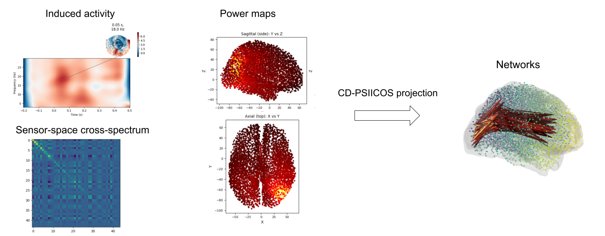

# CD-PSIICOS

<table>
<tr>  
<td width="220">
  </td>
<td>

CD-PSIICOS (Context-Dependent PSIICOS) (Kleeva & Ossadtchi, 2025) is an advanced Python toolbox for robust MEG/EEG functional connectivity estimation. It builds upon the original PSIICOS framework (Ossadtchi et al., 2018) to suppress spatial leakage while preserving true zero-phase coupling — a critical challenge in source-space analysis.

What sets CD-PSIICOS apart is its ability to adapt to the actual power distribution in the brain, making the estimation of connectivity more selective and interpretable, especially in complex cognitive or clinical paradigms. Whether you're analyzing task-induced dynamics, studying long-range cortical communication, or evaluating connectivity biomarkers in patient populations — this toolbox is for you.
</td>
</tr>
</table>

## Features:
- Suppression of spatial leakage artifacts without discarding zero-phase synchrony.
- Task-adaptive projections that enhance sensitivity to relevant interactions via power-informed weighting.
- Works seamlessly with standard MNE-Python forward models and epoched data.

## Modules:
- `fwd.py` — Utilities for forward modeling
- `conn.py` — Cross-spectral estimation, connectivity matrix building, visualization tools
- `psiicos.py` — Functions for PSIICOS and CD-PSIICOS projector construction and application
- `inv.py` - Functions for inverse modeling

  

## Example usage
An example script demonstrating the use of the algorithm is available in `scripts/CD-PSIICOS demo.ipynb`

## Citation
If you use this code, please cite the following paper:

*Kleeva, D., & Ossadtchi, A. (2025). Context-dependent PSIICOS: A novel framework for functional connectivity estimation accounting for task-related power leakage. NeuroImage, 121268* 

*https://doi.org/10.1016/j.neuroimage.2025.121268* 

## License
This project is licensed under the [MIT License](./LICENSE).
